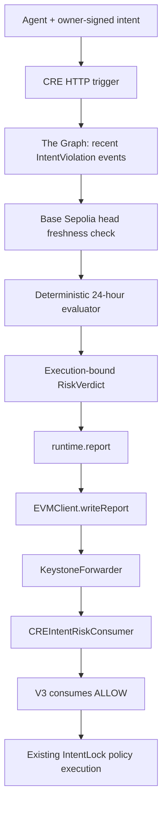

# Cresnex IntentLock

**Intent- and Outcome-Bound Execution with Persistent Containment for Autonomous Smart Accounts**

> **Cresnex IntentLock is an unaudited research prototype intended only for local development and public testnets. It is not production-ready and must not be used with real assets.**

**Cresnex IntentLock v0.1 Beta** is an MIT-licensed, testnet-only Web3 security research implementation for AI-agent-controlled smart accounts. It authenticates an owner-signed EIP-712 intent, executes exact calls in an isolated external self-call, verifies their final financial outcome, and reverts unsafe nested effects while preserving evidence and quarantining repeat offenders in the outer frame.

It does not reverse confirmed transactions. It is not audited, production-ready, a full ERC-4337 account, or intended for real assets.

## ETHOnline 2026 — Continuity Track

### Pre-existing before ETHOnline 2026

The repository history before ETHOnline 2026 already includes:

- V1 and V2 IntentLock smart contracts;
- an EIP-712 owner-signed intent flow with account, agent, chain, nonce, validity, calls, and policy binding;
- spend, output, recipient, protected-balance, native-value, and final-allowance policy enforcement;
- isolated execution with rollback, persistent evidence, strikes, and agent quarantine;
- Foundry unit, fuzz, invariant, and gas-benchmark test suites;
- a Next.js dashboard using wagmi and viem; and
- the existing V2 research modules, TypeScript SDK/browser lab, academic baselines, and deployment tooling documented below.

### Built / pending during ETHOnline 2026

Unchecked items are planned work and must not be described as implemented until executable evidence exists:

- [x] Base Sepolia V2 deployment baseline
- [x] Project-owned The Graph subgraph baseline for indexing real `IntentViolation` events
- [x] Deploy and validate the subgraph against live Base Sepolia events
- [x] Query live Graph-provider data for recent agent policy violations
- [x] Implement deterministic context-aware agent risk evaluation
- [x] Feed live Graph-derived risk context into a Chainlink CRE workflow
- [x] Produce a versioned, execution-bound `RiskVerdict` and simulate report delivery
- [x] Add a tested onchain CRE report consumer and CRE-gated V3 execution path
- [x] Authenticate reports by immutable Forwarder plus one-time workflow ID and owner
- [x] Implement fail-closed behavior for stale, malformed, missing, or errored Graph data
- [x] Add adversarial/security tests covering Graph, CRE, report replay, and binding failures
- [x] Update the ETHOnline frontend/demo with truthful live, simulated, and pending status
- [x] Document reproducible demo and prize evidence
- [ ] Deploy the CRE workflow, consumer, and V3 after CRE Deploy Access is enabled
- [ ] Prove real KeystoneForwarder-to-consumer delivery on Base Sepolia

### ETHOnline architecture



- **The Graph** provides live indexed behavioral/onchain context.
- **Chainlink CRE** independently queries the signal, checks chain freshness, derives the verdict, and constructs a report. Current evidence covers local CRE simulation; it does not claim Confidential Workflows.
- **IntentLock** remains the final deterministic enforcement boundary for owner-signed transaction policies.

Fundamental IntentLock safety invariants must not move entirely into Chainlink CRE. Spend limits, allowed recipients, approval limits, slippage and minimum-output requirements, nonce and deadline checks, and allowed operation/call constraints remain deterministically enforceable by IntentLock contracts or owner-signed policy.

CRE `ALLOW` is necessary but not sufficient: every existing signature, nonce, call, policy, isolation, and postcondition check still runs. CRE rejection does not consume the intent nonce, create a strike, quarantine the agent, or emit `IntentViolation`. The existing live V2 deployment is not retroactively CRE-gated.

The repository contains the CRE workflow, report consumer, V3 gate, tests, and deployment tooling. `runtime.report()` and `EVMClient.writeReport()` have been demonstrated in local CRE simulation only. The workflow, consumer, and V3 are not yet deployed, and real KeystoneForwarder delivery has not yet been proven. No confidential-execution claim is made.

The Graph qualification path requires live provider data; mocked, static, or local-only Graph responses do not demonstrate the sponsor integration. The signal is limited to recent indexed IntentLock `IntentViolation` events and is not universal agent reputation. Missing, stale, malformed, or indexing-error data must never silently produce `ALLOW`.

### Current ETHOnline deployment status

| Component | Status |
| --- | --- |
| Base Sepolia V2 | **LIVE** |
| The Graph subgraph and live query | **LIVE** |
| CRE local simulation | **WORKING** |
| CRE live deployment | **PENDING DEPLOY ACCESS** |
| CRE consumer | **TESTED / NOT DEPLOYED** |
| CRE-gated V3 | **TESTED / NOT DEPLOYED** |
| Real KeystoneForwarder delivery | **NOT YET PROVEN** |

### Deterministic risk rule

The narrow signal asks: **How many recent indexed IntentLock policy violations has this agent caused in the last 24 hours?**

| Count | Decision |
| ---: | --- |
| 0 | `ALLOW` |
| 1–2 | `ESCALATE` |
| 3+ | `BLOCK` |

Graph errors, malformed responses, indexing errors, and stale indexing produce a fail-closed operational `BLOCK`. This signal is only “recent indexed IntentLock policy violations,” not universal reputation or proof that an agent is safe.

### ETHOnline demo target

```text
Scenario A — Safe agent action

Signed policy        PASS
Graph risk context   LOW
CRE risk verdict     ALLOW
IntentLock           EXECUTE

Scenario B — Risky agent action

Signed policy        PASS
Graph risk context   HIGH
CRE risk verdict     ESCALATE / BLOCK
IntentLock V3        NO AUTONOMOUS EXECUTION
V2 discipline state  UNCHANGED BY CRE REJECTION
```

The demo target is to prove that external risk context materially changes the IntentLock outcome; The Graph and Chainlink are not presented only as dashboard data.

See the [ETHOnline technical evidence](docs/ethonline-2026.md), [deployment runbook](docs/ethonline-2026-deployment.md), and [three-minute demo script](docs/ethonline-2026-demo.md).

## Why it exists

Target and calldata validation prove what an agent attempted to call, but not necessarily what financially happened. IntentLock binds both path and measurable postconditions: maximum input spent, minimum output received by the signed recipient, and maximum final allowance.

## Security flow

1. The owner signs account, agent, chain, canonical calls hash, policy, nonce and validity.
2. The registered agent submits the exact call list and signature.
3. The outer frame authenticates it and permanently consumes the nonce.
4. An external self-call snapshots balances, executes ordinary calls, and verifies postconditions.
5. A safe execution commits and emits `IntentExecuted`.
6. An unsafe execution reverts its inner frame. The outer frame stores compact evidence, adds a strike and quarantines at the threshold.

See the comprehensive [code architecture](docs/architecture.md) and [threat model](docs/threat-model.md).

## Open-source beta

The standalone account architecture is the current supported research target. ERC-4337 and ERC-7579 compatibility are later milestones after the policy model, tests, SDK, and documentation stabilize.

- [Roadmap](ROADMAP.md)
- [Contributing](CONTRIBUTING.md)
- [Security policy](SECURITY.md)
- [Governance](GOVERNANCE.md)
- [Code of conduct](CODE_OF_CONDUCT.md)
- [Changelog](CHANGELOG.md)
- [MIT License](LICENSE)

## Supported MVP

One owner, multiple registered agents, single/ordered batch calls (maximum 16), mock USDC/WETH/router, EIP-712 signatures, nonce/time bounds, spend/output/recipient/allowance policies, strikes, quarantine, pause, two-step ownership and emergency token recovery. There is no delegatecall.

Authentication and malformed-intent failures revert without strikes. Valid authenticated intents whose execution or outcome is unsafe consume the nonce and persist a violation.

## Intent Manifest v2 — Phase 1

The repository now also contains a separate, non-upgradeable `CresnexIntentLockAccountV2` research contract. It does not reinterpret v1 signatures or replace a deployed v1 account.

Phase 1 adds:

- a versioned manifest binding owner, policy hash, operation mode, and evidence configuration;
- bounded arrays of up to eight ERC-20 outcome constraints and eight allowance constraints;
- native-token spend and minimum-balance constraints;
- transfer, swap, approval, and exact ordered-batch policy modules;
- mock ERC-721/ERC-1155 purchase and selector-allowlisted administration modules;
- stable violation codes and compact block/timestamp evidence;
- owner nonce cancellation and emergency agent revocation; and
- non-punitive classification for ordinary target failures.

See [the v2 EIP-712 schema](docs/eip712-schema.md), [policy definitions](docs/policies.md), and [known limitations](docs/known-limitations.md). The existing dashboard and published deployment flow remain v1 until the dedicated SDK/frontend and deployment phases; they must not be pointed at a v2 address yet.

Phase 2 additionally implements mock ERC-4626 deposit and withdrawal policies plus a controlled yield rebalance across signed mock vaults. It measures underlying/share deltas, caps final allowances and aggregate movement, and enforces a minimum portfolio value using a deterministic mock price source. This is research infrastructure—not a real yield optimizer, live-protocol integration, or production oracle design.

Phase 3 adds bounded DAO treasury payments, payroll, and recurring subscriptions. It persists unique treasury references, epoch spend, payroll IDs and employee periods, subscription billing periods and payment counts, and owner cancellation. These are payment-policy research fixtures, not full governance, payroll administration, or merchant billing systems.

Phase 4 adds fixed-interface mock ERC-721/ERC-1155 purchases and carefully bounded mock protocol administration. NFT policies verify exact delivery after measured ERC-20 or native payment and enforce residual allowance caps. Administration permits only five explicit selectors and rejects ownership transfer, upgrades, extra calls, and values outside signed bounds. Module-specific v2 validation lives in an immutable stateless validator deployed with the account; it cannot execute account calls, mutate account state, or be replaced. The account remains responsible for authentication, nonces, isolated execution, generic outcome measurement, evidence, strikes, quarantine, and recovery.

Phase 5 adds an explicitly versioned TypeScript v2 SDK and browser lab. It builds all twelve policy encodings, mirrors Solidity's canonical hashes, signs v2 EIP-712 manifests, simulates exact packages, exports bigint-safe JSON, rejects tampered imports, submits from the bound agent, and decodes v2 evidence separately from v1. See [SDK packages](docs/sdk.md) and the [frontend demonstration](docs/frontend-demo.md).

Phase 6 adds three explicitly unsafe academic baselines, 30-run comparative gas/outcome measurements, a complete local/testnet research-stack deployment script, public deployment manifests, chain-state smoke checks, and a measured dashboard section. See [experiments](docs/experiments.md) and [deployment](docs/base-sepolia-deployment.md). No Base Sepolia address is published until an actual broadcast and smoke check occur.

## Repository

- `contracts/`: Solidity account, mocks, Foundry tests and Base Sepolia script
- `web/`: Next.js App Router dashboard using wagmi and viem
- `shared/`: generated ABI and deployment-address handoff
- `docs/`: architecture, threat model, experiment and presentation plans

## Prerequisites and installation

Use Foundry 1.7+, Node 20+ and npm 10+. Dependencies are pinned in the checked-out Foundry libraries and `package-lock.json`.

```bash
cp .env.example .env
cd contracts
forge build
forge test
cd ../web
npm ci
npm run dev
```

Never put a funded production key in source control.

## Tests and benchmarks

```bash
cd contracts
forge fmt --check src test script
forge build
forge test
forge test --match-path 'test/fuzz/*'
forge test --match-path 'test/invariant/*'
forge test --gas-report
forge coverage
forge snapshot
```

The suites cover valid single/batch execution, access control, signature/account/chain/time/nonce/calls-hash failures, rollback of spend/output/recipient/allowance violations, evidence, strikes, quarantine/recovery, only-self isolation, reentrancy and pause. The stateful handler drives randomized overspend, insufficient-output and excessive-allowance attempts and separately probes a quarantined account. Six invariants assert balance rollback, allowance containment, nonce replay rejection, quarantine enforcement, owner-only recovery and evidence persistence. The experiment methodology and blank results table are in [experiment-plan.md](docs/experiment-plan.md). Gas results should be regenerated on the evaluation machine; they are not presented as universal figures.

Invariant limitations: the handler uses conventional mock ERC-20s and the mock router, one protected input/output pair, one agent and bounded values. It does not prove behavior for malicious tokens, arbitrary external protocols, gas exhaustion, owner compromise or every possible call graph. These tests are executable evidence, not formal verification.

The checked-out Solidity dependencies are pinned to OpenZeppelin Contracts `v5.3.0` (`e4f7021…`) and forge-std `v1.9.7` (`77041d2…`). Frontend versions are exact in `package.json` and locked transitively by `package-lock.json`.

## Local deployment

```bash
anvil
# In another terminal:
cast wallet import local-deployer --interactive
export OWNER_ADDRESS="$(cast wallet address --account local-deployer)"
cd contracts
forge script script/DeployBaseSepolia.s.sol:DeployBaseSepolia \
  --rpc-url http://127.0.0.1:8545 --account local-deployer --broadcast
```

Enter one of Anvil's displayed development-only private keys when prompted. Copy emitted addresses into `.env.local` using the `NEXT_PUBLIC_*` names, including `NEXT_PUBLIC_LOCAL_RPC_URL=http://127.0.0.1:8545` and a `NEXT_PUBLIC_DEPLOYMENT_BLOCK` value. Switch the wallet to the Foundry/Anvil chain (ID `31337`), register the agent with the connected owner, fund only with mock tokens, then run the dashboard.

## Base Sepolia

```bash
cast wallet import deployer --interactive
cp .env.example .env
# Set BASE_SEPOLIA_RPC_URL and OWNER_ADDRESS (the deployer address).
set -a; source .env; set +a
cd contracts
forge script script/DeployBaseSepolia.s.sol:DeployBaseSepolia \
  --rpc-url "$BASE_SEPOLIA_RPC_URL" --account deployer --broadcast --verify
```

The keystore command prompts for the key and encrypts it outside this repository. Never place a private key in `.env`, and never use a `NEXT_PUBLIC_*` variable for signing material. Verification additionally requires the explorer configuration supported by your Foundry version. The script deploys mock research assets and funds the account with mock USDC; it does not register an agent.

## Frontend validation

```bash
cd web
npm ci
npm run lint
npm run typecheck
npm run build
```

The dashboard reads the deployed owner, pause state, quarantine threshold and selected-agent state; exposes owner-only registration, pause and recovery controls; and queries execution, violation, quarantine and recovery events. Set `NEXT_PUBLIC_DEPLOYMENT_BLOCK` to keep event queries efficient. It also constructs the same canonical call hash as Solidity and signs the `IntentManifest`. The owner selects a demo policy and signs it; the signed package stays in browser local storage until the connected agent wallet submits it. This makes replay and expired-intent demonstrations possible without exposing a private key. Injected wallets are always enabled; WalletConnect is added when `NEXT_PUBLIC_WALLETCONNECT_PROJECT_ID` is configured. Static comparison material is labeled conceptual rather than measured.

## Continuous integration

`.github/workflows/ci.yml` runs formatting, compilation, tests with a gas report, coverage, frontend linting, type checking and the production build on pushes and pull requests.

## Vercel deployment

Set the Vercel project **Root Directory** to `web`. The frontend contains its required runtime ABI declarations and can be built independently from the Foundry workspace.

Before deployment, create a Base Sepolia deployment and configure these Vercel project variables for Production, Preview and Development as appropriate:

```env
NEXT_PUBLIC_CHAIN_ID=84532
NEXT_PUBLIC_BASE_SEPOLIA_RPC_URL=
NEXT_PUBLIC_WALLETCONNECT_PROJECT_ID=
NEXT_PUBLIC_ACCOUNT_ADDRESS=
NEXT_PUBLIC_DEPLOYMENT_BLOCK=
NEXT_PUBLIC_USDC_ADDRESS=
NEXT_PUBLIC_WETH_ADDRESS=
NEXT_PUBLIC_ROUTER_ADDRESS=
```

Do not upload `web/.env.local`; it contains local Anvil addresses that public visitors cannot reach. Deploy from the CLI with `npx vercel` and promote with `npx vercel --prod`, or import the repository through the Vercel Git integration.

## Attack demonstrations

The dashboard includes valid swap, overspend, insufficient-output, wrong-recipient, unlimited-approval, hidden-malicious-batch and expired-intent templates. Submit an already successful stored package a second time to demonstrate replay rejection. The mock router exposes explicit valid, overspend, insufficient-output, wrong-recipient and partial-failure behaviors. Tests also demonstrate excessive approval and reentrancy. Follow [demo-script.md](docs/demo-script.md).

## Security assumptions and limitations

The owner key, policy choices and conventional ERC-20 behavior are trusted. One manifest protects only its named input/output/approval assets; arbitrary calls may affect unmeasured assets. Malicious/rebasing/fee tokens, oracle manipulation, MEV, gas griefing and owner compromise are outside the model. Timestamp boundaries inherit normal validator timestamp tolerance. Revert data is hashed, but the EVM still allocates returned data before hashing. Recovery is powerful owner authority.

## Future work

Bound multiple asset deltas, add target allowlists as an optional policy, improve stateful handlers, test adversarial token callbacks, integrate a safe module/account standard without claiming premature compliance, and conduct independent review.

## Academic evaluation

Compare unprotected, spend-only, path-only and outcome-bound systems using the reproducible plan. Report negative gas/latency results, compiler/configuration, raw trials and false positives. Do not substitute seeded UI examples for measured data.

## Disclaimer

Educational research code only. No formal verification or external audit has been performed. Do not custody real value.

## Verified x402 testnet proof

The standalone x402 demo completed one official v2 exact-EVM Base Sepolia flow using MetaMask/viem EIP-712 authorization and facilitator settlement. `1000` atomic units (`0.001 USDC`) of official Circle USDC moved from the dedicated payer to the merchant in transaction `0x27aa742192f21bdebd4f60cbbbb05672504141d3de4e6a367ef23d192669c7b0` at block `46724208`; the observed flow was HTTP `402` → `PAYMENT-SIGNATURE` → settlement → HTTP `200`. This is not an IntentLock HTTP domain/path enforcement claim.
