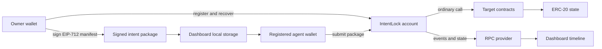
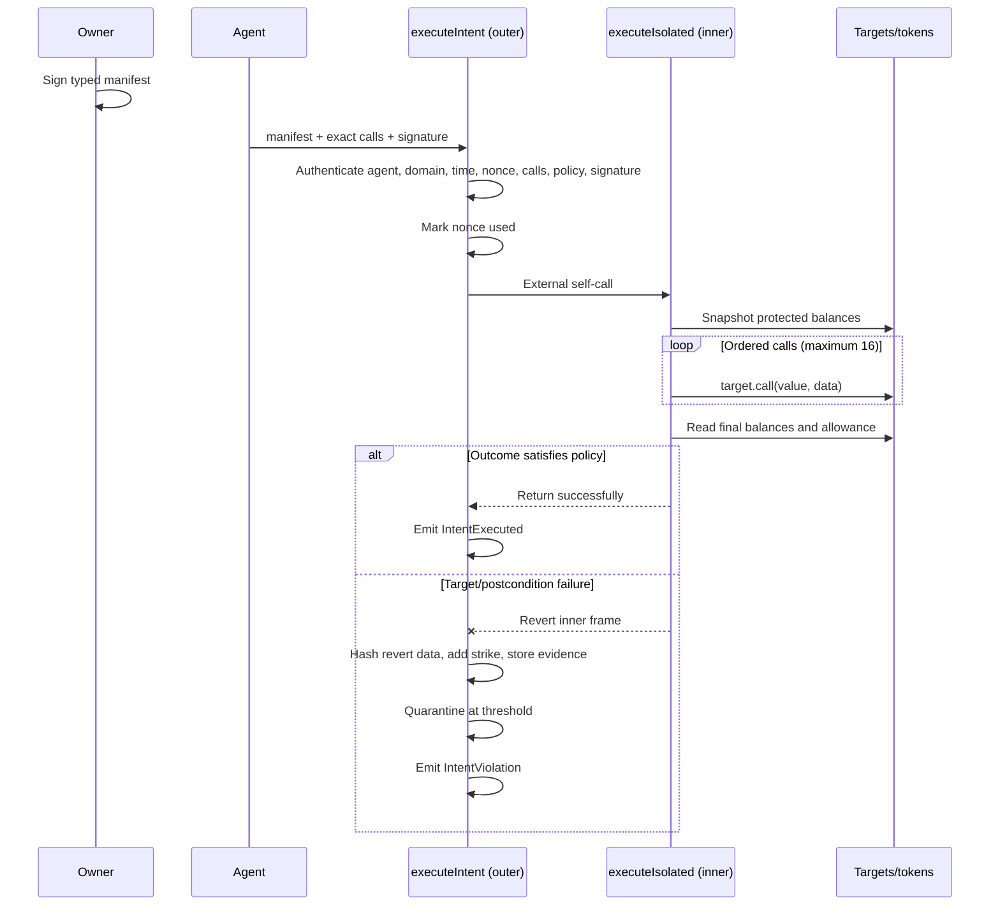
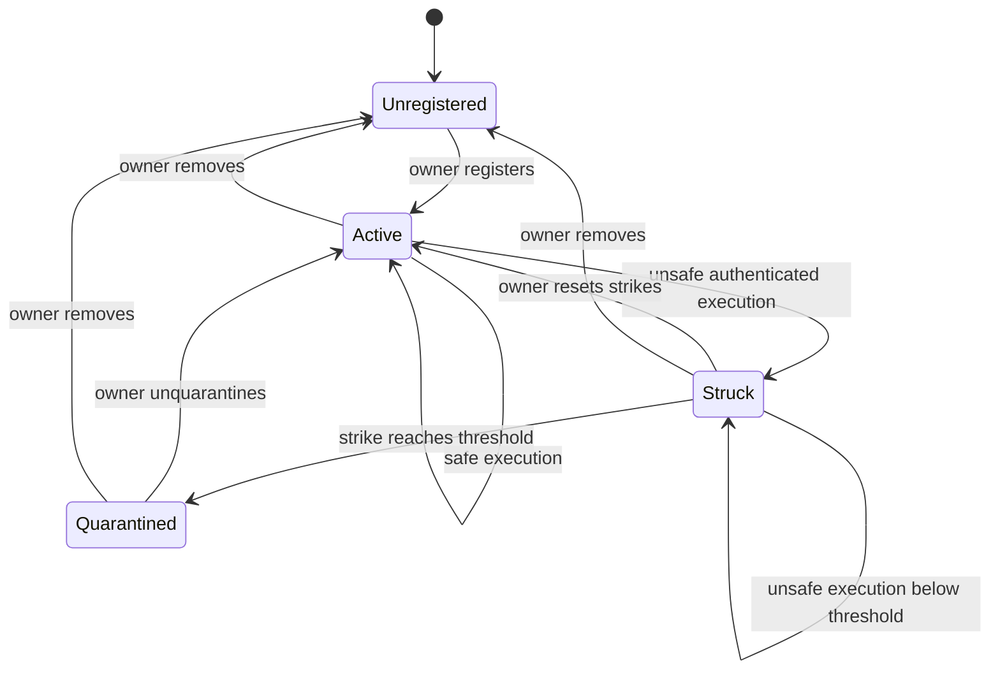
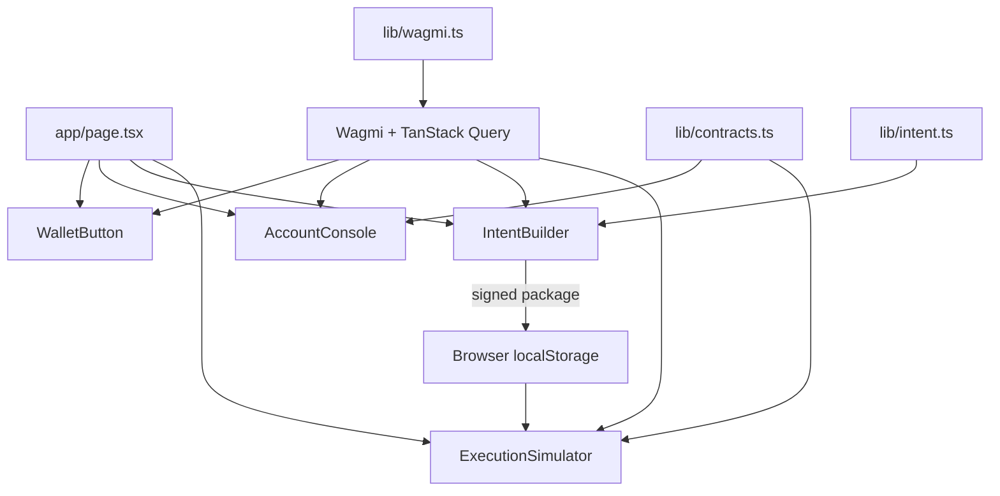

# Cresnex IntentLock code architecture

This document describes the architecture implemented by this repository. Cresnex IntentLock is security-critical research code: it is a working prototype for intent- and outcome-bound smart-account execution, but it is not audited, production-ready, or intended to custody real assets.

## Version status

The numbered v1 sections below describe the original deployment-compatible prototype. Phase 1 adds `CresnexIntentLockAccountV2` as a separate, non-upgradeable research contract with a new typed-data domain and ABI.

V2 preserves the outer authentication → nonce consumption → external self-call → classification flow, but replaces the single input/output/allowance tuple with bounded arrays. It distinguishes authenticated `PolicyViolation` failures from ordinary `TargetCallFailed` failures; only policy violations add strikes. See [eip712-schema.md](eip712-schema.md) and [policies.md](policies.md) for the implemented modules.

Phase 2 adds ERC-4626-shaped deposit/withdrawal validation and controlled yield-rebalance postconditions. The account treats vault return values as untrusted, measures underlying and share balances, and derives mock portfolio value only from the signed deterministic pricing fixture. No production protocol or oracle integration is implied.

Phase 3 adds successful-payment state in the outer controller. Treasury references/budgets, payroll IDs/periods, and subscription periods/counts are checked during isolated authenticated validation and recorded only after inner execution succeeds. Policy violations leave those success registries unchanged while still preserving violation evidence and strikes.

Phase 4 delegates module-specific shape, signed-call, and specialized postcondition validation for every v2 module to an immutable `Phase4PolicyValidator` created in the account constructor. The validator has no authority or mutable state, receives no user-selected module address, and never executes signed calls. Stateful treasury, payroll, and subscription replay/budget checks remain in the account. The account also retains hashing, authentication, nonce state, isolated execution, generic balance/allowance measurement, evidence, strikes, quarantine, and owner controls. This external boundary uses ordinary read-only calls—never `delegatecall`, a proxy, or a mutable registry—and reduces account runtime from 24,403 bytes to 15,420 bytes.

Phase 5 keeps v1 and v2 clients explicitly separate. The v2 TypeScript layer mirrors the Solidity hash functions, uses the version-2 domain, validates imported package commitments, and submits the exact manifest/calls/policy tuple. Its event reader uses the v2 ABI and violation-code table rather than interpreting v2 logs through the legacy schema.

Phase 6 introduces three independent academic baseline contracts. They do not share execution code or storage with IntentLock and are never selected by the production research account. The deployment script creates immutable v1/v2 accounts and clearly labelled mocks, then writes public chain metadata after broadcasting. Local smoke checks compare that manifest with deployed owner, funding, oracle, and bytecode state.

## 1. System context

The system separates authority, submission, execution, and observation:

- The **owner** controls the account, registers agents, defines an intent policy, and signs the EIP-712 manifest.
- A registered **agent** submits the exact calls, manifest, and owner signature.
- `CresnexIntentLockAccount` authenticates the package, executes calls in an isolated frame, and verifies financial postconditions.
- External **targets** receive ordinary EVM calls. They are not trusted to produce the intended outcome.
- The **dashboard** builds and signs intents, submits saved packages, exposes owner controls, and reads security events.
- **Mock contracts** provide deterministic safe and adversarial behavior for demonstrations and tests.



The owner and agent may be different EOAs. The owner signature authorizes a bounded action; the agent pays for and submits the execution transaction.

## 2. Repository layout

```text
.
├── contracts/
│   ├── src/
│   │   ├── CresnexIntentLockAccount.sol
│   │   ├── IntentTypes.sol
│   │   ├── interfaces/ICresnexIntentLock.sol
│   │   └── mocks/
│   ├── script/DeployBaseSepolia.s.sol
│   └── test/
│       ├── unit/
│       ├── fuzz/
│       ├── invariant/
│       └── GasBenchmarks.t.sol
├── web/
│   ├── app/
│   ├── components/
│   └── lib/
├── shared/
│   ├── abi/
│   └── deployments/
├── docs/
└── Makefile
```

| Area | Responsibility |
| --- | --- |
| `contracts/src` | Account implementation, shared data types, interface, and research mocks |
| `contracts/test` | Unit, fuzz, invariant, and gas benchmark coverage |
| `contracts/script` | Local/Base Sepolia research deployment |
| `web/app` | Next.js page shell, providers, layout, and styling |
| `web/components` | Wallet, owner console, intent builder, execution simulator, and event timeline |
| `web/lib` | ABI declarations, addresses, wagmi configuration, typed-data schema, and canonical hashing |
| `shared/abi` | Contract ABI handoff generated from Foundry output |
| `shared/deployments` | Reserved location for real, chain-specific deployment records |
| `docs` | Architecture, threat model, experiment, and demonstration material |

## 3. Contract architecture

### 3.1 Main account

`contracts/src/CresnexIntentLockAccount.sol` is the primary trust boundary. It composes:

- OpenZeppelin `EIP712` and `ECDSA` for owner-signed manifests.
- `Ownable2Step` for explicit ownership transfer.
- `Pausable` for owner-controlled execution shutdown.
- `ReentrancyGuard` for execution and recovery entry-point protection.
- `SafeERC20` for emergency token recovery.

The contract deliberately uses normal `call` for target execution. It contains no `delegatecall` and has no upgradeability mechanism.

### 3.2 Shared types

`contracts/src/IntentTypes.sol` defines the structures passed across the contract and frontend boundary.

`ExecutionCall` contains:

| Field | Meaning |
| --- | --- |
| `target` | Contract or EOA to call |
| `value` | Native-token value sent with the call |
| `data` | Complete calldata |

`IntentManifest` contains four groups of constraints:

| Group | Fields | Purpose |
| --- | --- | --- |
| Domain | `account`, `agent`, `chainId` | Prevent use by another account, submitter, or chain |
| Exact path | `callsHash`, `allowBatch` | Bind the ordered targets, values, and calldata |
| Financial outcome | input/output/recipient/approval fields | Bound spend, output, destination, and residual allowance |
| Replay/time | `nonce`, `validAfter`, `validUntil` | Prevent replay and constrain the validity window |

The current MVP protects one input token, one output token, one recipient, and one token/spender allowance pair per manifest.

### 3.3 Public interface

`contracts/src/interfaces/ICresnexIntentLock.sol` exposes the execution entry point, agent state, violation records, and core security events. `CresnexIntentLockAccount` also exposes owner administration and hashing helpers.

| Function group | Functions |
| --- | --- |
| Agent administration | `registerAgent`, `removeAgent`, `resetAgentStrikes`, `unquarantineAgent` |
| Global administration | `setQuarantineThreshold`, `pause`, `unpause` |
| Emergency authority | `recoverToken` |
| Hashing | `hashExecutionCall`, `hashCalls`, `hashIntent` |
| Execution | `executeIntent`, `executeIsolated` |

`executeIsolated` is public only because the account must enter it through an external self-call. The `onlySelf` modifier makes it inaccessible to owners, agents, and arbitrary callers.

## 4. Intent encoding and signature boundary

The domain separator is:

```text
name:              Cresnex IntentLock
version:           1
chainId:           active chain
verifyingContract: deployed account
```

Each call is hashed as:

```text
keccak256(
  abi.encode(
    EXECUTION_CALL_TYPEHASH,
    target,
    value,
    keccak256(data)
  )
)
```

The ordered call list is hashed as:

```text
keccak256(abi.encode(calls.length, callHashes))
```

Including both the length and ordered hash array prevents a caller from inserting, deleting, or reordering calls without invalidating `callsHash`.

The manifest is hashed as EIP-712 typed data. `web/lib/intent.ts` mirrors the Solidity call hashing exactly, and its `intentTypes` declaration must remain field-for-field compatible with `INTENT_TYPEHASH`. Any public schema change must update Solidity, the frontend declaration, the frontend ABI, generated ABI artifacts, tests, and documentation together.

## 5. Execution lifecycle

The most important architectural property is the split between a durable outer frame and a revertible inner frame.



### 5.1 Authentication phase

`_authenticate` runs before the nonce is consumed or targets are called. It checks:

1. `msg.sender` equals the manifest agent.
2. The agent is registered and not quarantined.
3. The manifest names this account and the active chain.
4. The validity window is well formed and currently active.
5. The nonce has not been used.
6. The call count is between 1 and 16.
7. Multi-call execution is explicitly allowed.
8. No call targets the zero address or the account itself.
9. Every address required by the financial policy is nonzero.
10. The submitted calls reproduce the signed `callsHash`.
11. The recovered EIP-712 signer is the current owner.

Authentication, formatting, and authorization failures revert the whole transaction. They do not consume a nonce or add a strike.

### 5.2 Durable outer frame

After successful authentication, `executeIntent`:

1. Permanently sets `usedNonces[nonce]`.
2. ABI-encodes `executeIsolated(manifest, calls)`.
3. calls `address(this).call(payload)`.
4. handles either the safe-return or unsafe-revert result.

The low-level external self-call is intentional. A revert inside `executeIsolated` unwinds target calls and token changes made in that inner frame without unwinding the already-authenticated outer function.

### 5.3 Isolated inner frame

`executeIsolated` snapshots:

- the account's input-token balance;
- the signed recipient's output-token balance.

It executes every call in order with ordinary EVM `call`, then measures. Successful target returndata is ignored. On target failure, the account hashes the reported returndata size together with at most its first 256 bytes. This prevents unbounded returndata copying while retaining compact failure evidence.

The measured postconditions are:

```text
spent    = max(inputBefore - inputAfter, 0)
received = max(outputAfter - outputBefore, 0)
allowance = approvalToken.allowance(account, approvalSpender)
```

The frame reverts when:

- a target call fails;
- `spent > maxInputAmount`;
- `received < minOutputAmount`; or
- `allowance > maxFinalAllowance`.

Because those failures revert the inner frame, nested transfers, approvals, and target state changes made during that frame revert atomically.

### 5.4 Persistent containment

When the inner call fails, the outer frame:

- extracts the first four revert bytes as a reason selector;
- hashes the complete revert data;
- increments the agent strike count;
- quarantines the agent at `quarantineThreshold`;
- computes an evidence hash;
- stores a compact `ViolationRecord`; and
- emits `IntentViolation` and, when applicable, `AgentQuarantined`.

The unsafe attempt returns `(false, evidenceHash)` instead of reverting the outer transaction. Its nonce remains consumed, so the same signed package cannot be replayed.

## 6. State model

| State | Key | Lifecycle |
| --- | --- | --- |
| `agents` | agent address | Registered/removed by owner; strikes added by violations; quarantine set automatically and cleared by owner |
| `usedNonces` | unsigned integer | Changes once from false to true after successful authentication |
| `violations` | evidence hash | Written after an authenticated unsafe attempt; no deletion path |
| `quarantineThreshold` | singleton | Defaults to 3; owner may set any nonzero value |
| pause state | singleton | Owner controlled through OpenZeppelin `Pausable` |
| owner/pending owner | singleton | Controlled through OpenZeppelin `Ownable2Step` |

Agent state transitions are:



`unquarantineAgent` clears only the quarantine flag; `resetAgentStrikes` clears only strikes. The dashboard exposes these as separate owner actions.

## 7. Security boundaries and invariants

### 7.1 Boundaries enforced in code

- Only the owner may manage agents, pause, change the threshold, or recover tokens.
- Only a registered, non-quarantined manifest agent may submit its intent.
- Only the contract itself may enter the isolated executor.
- `nonReentrant` protects `executeIntent` and `recoverToken`.
- The account cannot be an execution-call target.
- Calls are exact and ordered, not merely target-allowlisted.
- There is no `tx.origin`, `delegatecall`, or upgradeable proxy.

### 7.2 Properties tested by the invariant suite

The stateful tests assert that:

1. Unsafe execution cannot reduce the protected input balance.
2. Unsafe execution cannot leave an excessive protected allowance.
3. A consumed nonce cannot execute again.
4. A quarantined agent cannot execute.
5. A non-owner cannot clear quarantine.
6. Violation evidence persists after the inner rollback.

These properties are scoped to the repository's conventional mock ERC-20s, mock router, bounded handler inputs, and named protected assets. They are evidence for the prototype, not a proof for arbitrary tokens or protocols.

### 7.3 Trust assumptions and limitations

The owner key and signed policy are trusted. ERC-20 balance and allowance responses are assumed conventional. Only assets named in the manifest are measured. The design does not currently solve owner compromise, malicious token semantics, rebasing/fee tokens, unmeasured side effects, oracle manipulation, MEV, gas griefing, or arbitrary call-graph safety. See [threat-model.md](threat-model.md) for the complete scope.

## 8. Research mocks

The mock layer is demonstration and test infrastructure, not production protocol integration.

| Contract | Purpose |
| --- | --- |
| `MockERC20` | Mintable conventional token used as mock USDC/WETH |
| `MockDexRouter` | Produces valid, excessive-input, insufficient-output, wrong-recipient, and partial-failure behavior |
| `MaliciousTarget` | Exercises hidden transfers, unlimited approvals, and unexpected nested calls |
| `ReentrantTarget` | Attempts to call back into account execution |

The deployment script creates the account, mock USDC, mock WETH, and router, then funds the account with mock USDC. It does not register an agent.

## 9. Frontend architecture

The frontend is a client-heavy Next.js App Router application.



### 9.1 Providers and networks

`web/app/providers.tsx` installs `WagmiProvider` and `QueryClientProvider`. `web/lib/wagmi.ts` supports:

- Base Sepolia through the configured RPC or public fallback;
- local Foundry/Anvil on chain ID 31337;
- injected wallets; and
- WalletConnect when a project ID is configured.

### 9.2 Owner console and evidence timeline

`AccountConsole` reads owner, pause state, threshold, and selected-agent state. Owner-only UI actions call the corresponding administration methods. It queries execution, violation, quarantine, and recovery events from the configured deployment block, or from a bounded recent block window when no deployment block is supplied.

The UI is not an indexer. Its timeline is a convenience view over RPC event queries and shows at most the 20 newest combined events.

### 9.3 Intent builder

`IntentBuilder`:

1. constructs calls for a selected safe or attack scenario;
2. computes the same canonical call hash as Solidity;
3. builds the EIP-712 manifest;
4. asks the connected owner wallet to sign it; and
5. stores the package in `localStorage` under `cresnex.signedIntent`.

The built-in scenarios are valid swap, overspend, insufficient output, wrong recipient, unlimited approval, hidden malicious batch, expiry, and a custom exact call.

The browser stores only the signed package. It does not handle or persist an owner's private key.

### 9.4 Agent execution simulator

`ExecutionSimulator` loads the saved package, confirms that the connected address matches the signed agent, reconstructs bigint values, and calls `executeIntent`. It then directs the presenter to the event timeline to distinguish committed execution from contained execution.

This local-storage handoff is appropriate for the research demonstration. A production multi-party system would require an authenticated package transport and durable indexing layer.

## 10. Configuration and deployment

The frontend consumes only public configuration:

| Variable | Purpose |
| --- | --- |
| `NEXT_PUBLIC_CHAIN_ID` | Documented target chain |
| `NEXT_PUBLIC_BASE_SEPOLIA_RPC_URL` | Base Sepolia RPC |
| `NEXT_PUBLIC_LOCAL_RPC_URL` | Local Anvil RPC |
| `NEXT_PUBLIC_WALLETCONNECT_PROJECT_ID` | Optional WalletConnect integration |
| `NEXT_PUBLIC_ACCOUNT_ADDRESS` | Deployed IntentLock account |
| `NEXT_PUBLIC_DEPLOYMENT_BLOCK` | Lower bound for event queries |
| `NEXT_PUBLIC_USDC_ADDRESS` | Mock input token |
| `NEXT_PUBLIC_WETH_ADDRESS` | Mock output token |
| `NEXT_PUBLIC_ROUTER_ADDRESS` | Mock router |

No private key belongs in these variables. `NEXT_PUBLIC_*` values are included in the browser bundle.

The supported environments are:

- local Anvil for deterministic demonstrations;
- Base Sepolia for public research deployment; and
- Vercel for the static/server-rendered Next.js frontend.

The live frontend can be hosted independently of the Foundry workspace because its required ABI declarations are present in `web/lib/contracts.ts`.

## 11. Testing architecture

| Suite | Focus |
| --- | --- |
| Unit | Ownership, registration, signatures, domain separation, time, nonces, call binding, rollback, evidence, quarantine, recovery, reentrancy, and pause |
| Fuzz | Spend limit, output floor, and batch-length boundary behavior |
| Invariant | Stateful rollback, allowance containment, replay, quarantine, owner authority, and evidence persistence |
| Gas benchmarks | Valid single intent, valid batch intent, and failed-outcome evidence path |
| Frontend checks | ESLint, TypeScript, and optimized Next.js build |

Foundry is pinned to Solidity 0.8.26 with optimizer enabled, 200 optimizer runs, and IR compilation. The default fuzz and invariant settings are declared in `contracts/foundry.toml`.

Run the complete normal validation from the repository root:

```bash
make check
```

Additional research measurements:

```bash
cd contracts
forge test --match-path 'test/fuzz/*'
forge test --match-path 'test/invariant/*'
forge test --gas-report
forge coverage
forge snapshot
```

## 12. Change-impact guide

Use this map when modifying the system:

| Change | Files that normally move together |
| --- | --- |
| Manifest field or type | `IntentTypes.sol`, account typehash/hashing, `web/lib/intent.ts`, frontend ABI, tests, generated ABI, docs |
| Execution event or function | Interface, implementation, `web/lib/contracts.ts`, consuming component, generated ABI, tests |
| New protected postcondition | Manifest, isolated snapshots/checks, evidence tests, fuzz/invariant handlers, builder policy UI, threat model |
| New network/deployment | deployment script or record, public environment variables, wagmi chains/transports, README |
| New attack scenario | mock behavior/target, unit test, intent builder, demo script |
| Public owner control | contract access control and event, ABI, account console, unit tests, docs |

Security-relevant changes should preserve external-self-call isolation, persistent containment, nonce consumption after authentication, and owner-only administrative authority unless the design explicitly changes and is independently reviewed.

## 13. Current maturity

The repository implements an end-to-end research prototype:

- deployable contracts and mocks;
- owner signing and agent submission;
- isolated execution and outcome enforcement;
- persistent evidence, strikes, and quarantine;
- a public dashboard;
- unit, fuzz, invariant, and gas test infrastructure; and
- local/Base Sepolia deployment workflows.

Before production use it would require independent audit, adversarial-token and real-protocol testing, broader asset accounting, operational monitoring, production key/recovery design, additional gas hardening, and formal or substantially stronger verification. Real assets should not be deposited into the current deployment.
